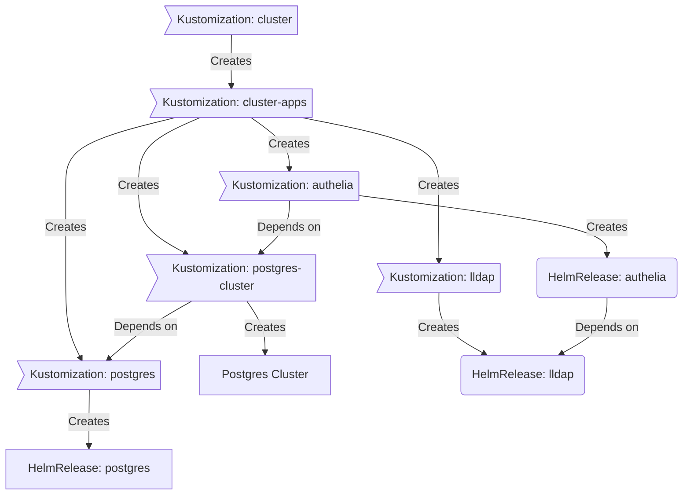

<div align="center">


### My Home Operations Repository :octocat:

_... managed with Flux, Renovate, and GitHub Actions_ 🤖

</div>

## 📖 Overview

This is a mono repository for my home infrastructure and Kubernetes cluster. I try to adhere to Infrastructure as Code (IaC) and GitOps practices using [Kubernetes](https://kubernetes.io/), [Flux](https://github.com/fluxcd/flux2), [Renovate](https://github.com/renovatebot/renovate), and [GitHub Actions](https://github.com/features/actions).

---

## ⛵ Kubernetes

My Kubernetes cluster is deployed with [Talos](https://www.talos.dev). This is a semi-hyper-converged cluster, workloads and block storage are sharing the same available resources on my nodes while I have a NAS for NFS/SMB shares, bulk file storage and backups.

There is a template over at [onedr0p/cluster-template](https://github.com/onedr0p/cluster-template) if you want to try and follow along with some of the practices I use here.

### Core Components

- [actions-runner-controller](https://github.com/actions/actions-runner-controller): Self-hosted Github runners.
- [cert-manager](https://github.com/cert-manager/cert-manager): Creates SSL certificates for services in my cluster.
- [cilium](https://github.com/cilium/cilium): Internal Kubernetes container networking interface.
- [cloudflared](https://github.com/cloudflare/cloudflared): Enables Cloudflare secure access to certain ingresses.
- [external-dns](https://github.com/kubernetes-sigs/external-dns): Automatically syncs ingress DNS records to a DNS provider.
- [external-secrets](https://github.com/external-secrets/external-secrets): Managed Kubernetes secrets using [1Password Connect](https://github.com/1Password/connect).
- [ingress-nginx](https://github.com/kubernetes/ingress-nginx): Kubernetes ingress controller using NGINX as a reverse proxy and load balancer.
- [rook](https://github.com/rook/rook): Distributed block storage for peristent storage.
- [sops](https://github.com/getsops/sops): Managed secrets for Kubernetes and Terraform which are commited to Git.
- [spegel](https://github.com/spegel-org/spegel): Stateless cluster local OCI registry mirror.
- [volsync](https://github.com/backube/volsync): Backup and recovery of persistent volume claims.

### GitOps

[Flux](https://github.com/fluxcd/flux2) watches the clusters in my [kubernetes](./kubernetes/) folder (see Directories below) and makes the changes to my clusters based on the state of my Git repository.

The way Flux works for me here is it will recursively search the `kubernetes/${cluster}/apps` folder until it finds the most top level `kustomization.yaml` per directory and then apply all the resources listed in it. That aforementioned `kustomization.yaml` will generally only have a namespace resource and one or many Flux kustomizations (`ks.yaml`). Under the control of those Flux kustomizations there will be a `HelmRelease` or other resources related to the application which will be applied.

[Renovate](https://github.com/renovatebot/renovate) watches my **entire** repository looking for dependency updates, when they are found a PR is automatically created. When some PRs are merged Flux applies the changes to my cluster.

### Directories

This Git repository contains the following directories under [Kubernetes](./kubernetes/).

```sh
📁 kubernetes
├── 📁 apps           # applications
├── 📁 bootstrap      # bootstrap procedures
├── 📁 flux           # core flux configuration
└── 📁 templates      # re-useable components
```

### Flux Workflow

This is a high-level look how Flux deploys my applications with dependencies. Below there are 3 apps `postgres`, `lldap` and `authelia`. `postgres` is the first app that needs to be running and healthy before `lldap` and `authelia`. Once `postgres` and `lldap` are healthy `authelia` will be deployed.


---

## Networking

The Talos nodes in my cluster, by default, are located on VLAN 80 (10.0.80.10-10.0.80.14) in my network. They also get an additional network interface located on my trusted VLAN (VLAN 10). This additional interface is used by [Multus](https://github.com/k8snetworkplumbingwg/multus-cni) to expose additional interfaces in certain apps like HomeAssistant. See [example](https://github.com/adampetrovic/home-ops/blob/main/kubernetes/apps/automation/home-assistant/app/helmrelease.yaml#L97-L102).

## ☁️ Cloud Dependencies

| Service                                         | Use                                                               | Cost           |
|-------------------------------------------------|-------------------------------------------------------------------|----------------|
| [1Password](https://1password.com/)             | Secrets with [External Secrets](https://external-secrets.io/)     | ~$100/yr       |
| [Cloudflare](https://www.cloudflare.com/)       | DNS & Public Tunnels                                              | Free           |
| [GitHub](https://github.com/)                   | Hosting this repository and continuous integration/deployments    | Free           |
|                                                 |                                                                   | Total: ~$9/mo  |

---

## 🌐 DNS

All my DNS records are hosted publically in Cloudflare, including DNS entries that point to a local IP address.

Outside the `external-dns` instance mentioned above another instance is deployed in my cluster and configured to sync DNS records to [Cloudflare](https://www.cloudflare.com/). The only ingress this `external-dns` instance looks at to gather DNS records to put in `Cloudflare` are ones that have an ingress class name of `external` and contain an ingress annotation `external-dns.alpha.kubernetes.io/target`.

---

## 🔧 Hardware

| Device                      | Count | OS Disk Size | Data Disk Size               | Ram  | Operating System | Purpose                 |
|-----------------------------|-------|--------------|------------------------------|------|------------------|-------------------------|
| Intel NUC12WSHi7            | 2     | 1TB SSD      | 1TB NVMe (rook-ceph)         | 64GB | Talos            | Kubernetes Nodes        |
| Intel NUC11PAHi7            | 2     | 1TB SSD      | 1TB NVMe (rook-ceph)         | 64GB | Talos            | Kubernetes Nodes        |
| Synology RS1219+            | 1     | -            | 6x 16TB Seagate Exos         | 4GB  | Synology DSM     | NAS - NFS Share         |
| Synology DVA1622            | 1     | -            | 2x 4TB Seagate Skyhawk       | 4GB  | Synology DSM     | NVR - Cameras           |
| Unifi UXG-Pro               | 1     | -            | -                            | -    | -                | Router / Gateway        |
| Unifi US-48-500W            | 1     | -            | -                            | -    | -                | PoE Rackmount Switch    |
| APC SMC1000I-2UC            | 1     | -            | -                            | -    | -                | UPS                     |
