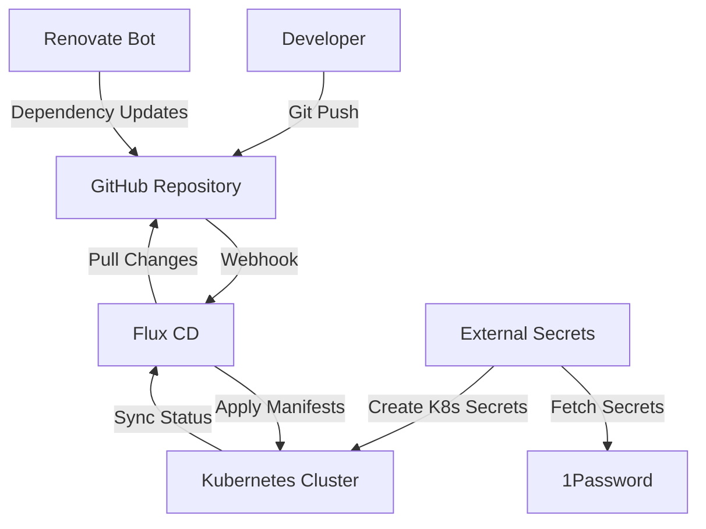
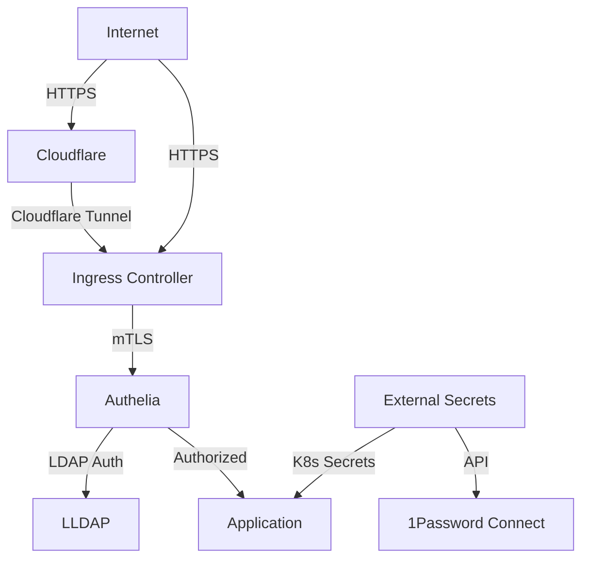
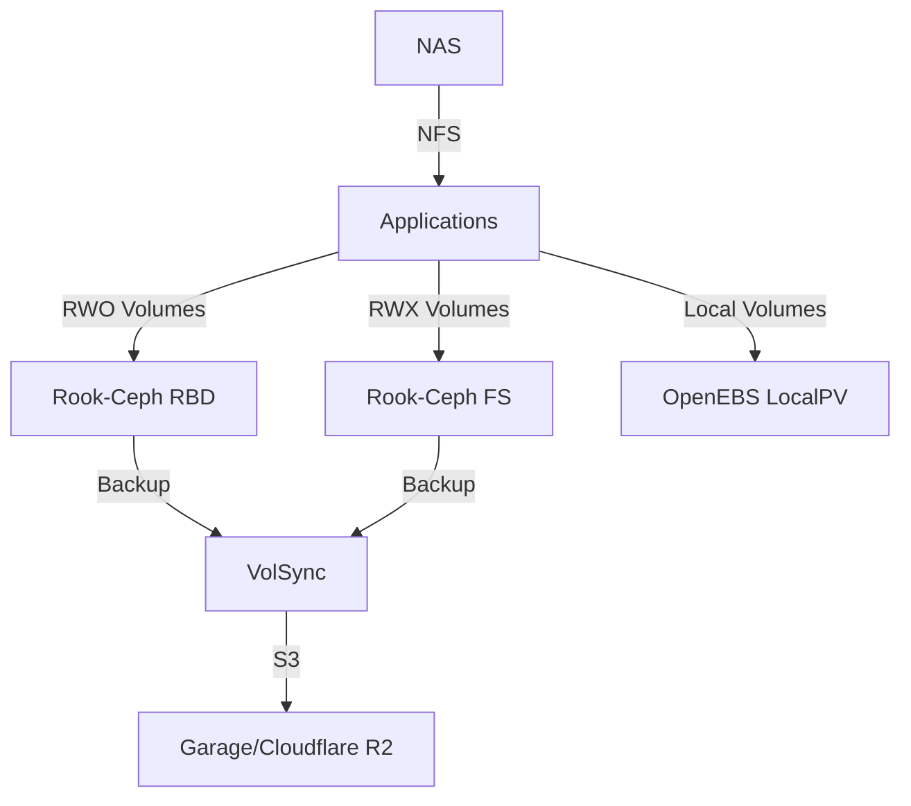

<div align="center">


# Home Operations Repository

_A comprehensive Kubernetes-native home infrastructure platform_

**🚀 GitOps • 🔒 Security-First • 🤖 Fully Automated**


</div>

---

## 📖 Overview

This repository contains the complete infrastructure-as-code (IaC) configuration for my home operations platform. Built on modern cloud-native principles, it demonstrates enterprise-grade practices scaled down for home use, featuring:

- **🏗️ Kubernetes-Native Architecture**: Built on [Talos Linux](https://talos.dev) for immutable infrastructure
- **⚡ GitOps Workflow**: Managed by [Flux CD](https://fluxcd.io) for declarative, Git-driven deployments
- **🔐 Zero-Trust Security**: Comprehensive authentication, authorization, and secrets management
- **🤖 Full Automation**: From hardware provisioning to application deployment
- **📊 Complete Observability**: Metrics, logs, traces, and alerting across the stack
- **🏠 Smart Home Integration**: IoT, automation, and media management platform

### 🎯 Core Principles

- **Infrastructure as Code**: Everything defined declaratively in Git
- **GitOps**: Git as the single source of truth for cluster state
- **Security by Design**: Zero-trust networking, encrypted secrets, automated updates
- **Cloud-Native**: Kubernetes-first, microservices architecture
- **Observability**: Comprehensive monitoring and alerting
- **Automation**: Minimal manual intervention required

---

## 🏗️ Infrastructure

### Cluster Architecture

The platform runs on a **high-availability Kubernetes cluster** powered by Talos Linux:

| Component | Details |
|-----------|---------|
| **OS** | [Talos Linux](https://talos.dev) v1.10.5 - Immutable, API-driven Linux |
| **Kubernetes** | v1.33.3 - Latest stable Kubernetes |
| **CNI** | [Cilium](https://cilium.io) - eBPF-based networking and security |
| **Nodes** | 4x Control Plane (no dedicated workers) |
| **High Availability** | Virtual IP, distributed etcd, automated failover |

### 🖥️ Hardware Specifications

| Device | Count | CPU | Cores | RAM | OS | Data | Purpose |
|--------|-------|-----|-------|-----|---------|-----------|---------|
| **Intel NUC12WSHi7** | 2 | i7-1265P | 12 (16 threads) | 64GB | 1TB SSD | 1TB NVMe | Kubernetes Control Plane |
| **Intel NUC11PAHi7** | 1 | i7-1165G7 | 4 (8 threads) |64GB | 1TB SSD | 1TB NVMe | Kubernetes Control Plane |
| **Intel NUC11PAHi7** | 1 | i7-1165G7 | 4 (8 threads) | 64GB | 1TB SSD | 1TB NVMe | Kubernetes Worker Node |
| **Minisforum MS-01** | 1 | i9-13900H | 14 (20 threads) | 96GB | 1TB NVMe | 2TB NVMe | Kubernetes Worker Node |
| **Synology RS1219+** | 1 | Atom C2538 | - | 4GB | - | 6×16TB | NAS Storage |
| **Synology DVA1622** | 1 | Atom C3508 | - | 4GB | - | 2×4TB | NVR/Security Cameras |
| **UniFi UXG-Pro** | 1 | - | - | - | - | Gateway/Router |
| **UniFi US-48-500W** | 1 | - | - | - | - | 48-Port PoE Switch |
| **APC SMC1000I-2UC** | 1 | - | - | - | - | UPS Power Management |

### 🌐 Network Topology

- **Management VLAN** (VLAN 80): `10.0.80.0/21` - Kubernetes nodes
- **Trusted VLAN** (VLAN 10): `10.0.10.0/24` - Home devices, secondary k8s interfaces
- **Cluster Networking**:
  - Pod CIDR: `10.69.0.0/16`
  - Service CIDR: `10.96.0.0/16`
  - LoadBalancer VIP: `10.0.80.99`

---

## 🚀 Applications

The platform hosts **60+ applications** across multiple categories:

### 🤖 AI & Machine Learning
- **[Ollama](https://ollama.ai)** - Local LLM inference server
- **[Open WebUI](https://openwebui.com)** - Modern ChatGPT-like interface for Ollama

### 🏠 Home Automation
- **[Home Assistant](https://home-assistant.io)** - Comprehensive home automation platform
- **[ESPHome](https://esphome.io)** - ESP8266/ESP32 device management
- **[Zigbee2MQTT](https://zigbee2mqtt.io)** - Zigbee device bridge
- **[Mosquitto](https://mosquitto.org)** - MQTT message broker
- **[Frigate](https://frigate.video)** - AI-powered network video recorder
- **[go2rtc](https://github.com/AlexxIT/go2rtc)** - Real-time streaming server
- **TeslaMate** - Tesla vehicle data logging and analytics
- **Fernwood Booker** - Custom multi-tenant appointment booking system

### 📺 Media Management
- **[Plex](https://plex.tv)** - Media server and streaming platform
- **[Sonarr](https://sonarr.tv)** + **[Sonarr 4K](https://sonarr.tv)** - TV series management
- **[Radarr](https://radarr.video)** + **[Radarr 4K](https://radarr.video)** - Movie management
- **[Prowlarr](https://prowlarr.com)** - Indexer aggregator
- **[Bazarr](https://bazarr.media)** - Subtitle management
- **[SABnzbd](https://sabnzbd.org)** - Usenet downloader
- **[qBittorrent](https://qbittorrent.org)** - BitTorrent client
- **[Jellyseerr](https://jellyseerr.dev)** - Media request management
- **[Tautulli](https://tautulli.com)** - Plex analytics and monitoring
- **[Unpackerr](https://unpackerr.zip)** - Archive extraction automation
- **[xTeVe](https://xteve.de)** - IPTV proxy server
- **Gatus** - Service monitoring and status page

### 🛠️ Productivity & Tools
- **[Atuin](https://atuin.sh)** - Shell history sync and search
- **[Memos](https://usememos.com)** - Privacy-first note-taking
- **[Miniflux](https://miniflux.app)** - Minimalist RSS reader
- **[Paperless-NGX](https://paperless-ngx.readthedocs.io)** - Document management system
- **[Change Detection](https://changedetection.io)** - Website monitoring
- **SpeedTest Tracker** - Internet speed monitoring

### 🗄️ Database & Storage
- **[CloudNative-PG](https://cloudnative-pg.io)** - PostgreSQL operator
- **[PgAdmin](https://pgadmin.org)** - PostgreSQL administration
- **[Dragonfly](https://www.dragonflydb.io/)** - In-memory data store, drop-in Redis replacement
- **[Garage](https://garagehq.deuxfleurs.fr)** - Distributed S3-compatible object storage

### 🔐 Security & Authentication
- **[Authelia](https://authelia.com)** - Authentication and authorization server
- **[LLDAP](https://github.com/lldap/lldap)** - Lightweight LDAP implementation
- **[External Secrets](https://external-secrets.io)** - Secrets management with 1Password
- **[cert-manager](https://cert-manager.io)** - Automatic TLS certificate management

### 🌐 Networking & DNS
- **[Cilium](https://cilium.io)** - eBPF-based CNI and security
- **[NGINX Ingress](https://kubernetes.github.io/ingress-nginx)** - HTTP/HTTPS ingress (Internal + External)
- **[Cloudflared](https://developers.cloudflare.com/cloudflare-one/connections/connect-apps/)** - Secure tunnels to Cloudflare
- **[External DNS](https://kubernetes-sigs.github.io/external-dns/)** - Automatic DNS record management
- **[AdGuard Home](https://adguard.com/adguard-home)** - Network-wide ad blocking
- **[Multus](https://github.com/k8snetworkplumbingwg/multus-cni)** - Multiple network interfaces
- **SMTP Relay** - Outbound email service

### 📊 Observability & Monitoring
- **[Prometheus](https://prometheus.io)** - Metrics collection and alerting
- **[Grafana](https://grafana.com)** - Metrics visualization and dashboards
- **[Loki](https://grafana.com/oss/loki/)** - Log aggregation and analysis
- **[Vector](https://vector.dev)** - Log collection and routing
- **[InfluxDB](https://influxdata.com)** - Time-series database
- **[UnPoller](https://github.com/unpoller/unpoller)** - UniFi metrics collection

### 💾 Storage Management
- **[Rook-Ceph](https://rook.io)** - Distributed block and object storage
- **[OpenEBS](https://openebs.io)** - Local persistent volumes
- **[VolSync](https://volsync.readthedocs.io)** - Volume backup and synchronization
- **Snapshot Controller** - Volume snapshot management

### ⚙️ System Services
- **[Reloader](https://github.com/stakater/Reloader)** - Automatic pod restarts on config changes
- **[Descheduler](https://github.com/kubernetes-sigs/descheduler)** - Pod rescheduling optimization
- **[Spegel](https://github.com/spegel-org/spegel)** - Local container registry mirror
- **[Intel Device Plugin](https://github.com/intel/intel-device-plugins-for-kubernetes)** - GPU and hardware acceleration
- **[Node Feature Discovery](https://kubernetes-sigs.github.io/node-feature-discovery/)** - Hardware feature detection
- **[Metrics Server](https://github.com/kubernetes-sigs/metrics-server)** - Resource usage metrics

---

## 🏛️ Architecture

### GitOps Workflow



**[Flux CD](https://fluxcd.io)** continuously monitors the Git repository and automatically applies changes to the cluster:

1. **Source Controller** - Monitors Git repositories and Helm charts
2. **Kustomize Controller** - Applies Kustomize configurations
3. **Helm Controller** - Manages Helm releases
4. **Image Automation** - Automatically updates container images

### Security Architecture



- **Zero-Trust Network**: All traffic encrypted and authenticated
- **Multi-Factor Authentication**: TOTP, WebAuthn, and Duo support
- **Secrets Management**: Encrypted at rest with SOPS, fetched from 1Password
- **Certificate Management**: Automated TLS with Let's Encrypt
- **Network Policies**: Microsegmentation with Cilium

### Storage Strategy



- **Distributed Storage**: Rook-Ceph across all nodes for redundancy
- **Local Storage**: OpenEBS for high-performance local volumes
- **Network Storage**: NFS mounts from Synology NAS
- **Backup Strategy**: VolSync for automated volume backups to S3-compatible storage

### Networking Deep Dive

- **CNI**: Cilium with eBPF for high-performance networking
- **Load Balancing**: MetalLB for bare-metal LoadBalancer services
- **Ingress**: Dual NGINX controllers (internal/external) with TLS termination
- **DNS**: AdGuard Home for network-wide filtering, cloudflare for both internal and external DNS management
- **Multi-Homing**: Multus CNI for additional network interfaces (IoT VLAN access)

---

## 🔧 Operations & Automation

### Task Automation

The repository includes comprehensive [Taskfile](https://taskfile.dev) automation:

```bash
# Cluster operations
task talos:generate           # Generate Talos configuration
task talos:apply              # Apply Talos configuration
task talos:bootstrap          # Bootstrap new cluster
task talos:fetch-kubeconfig   # Generate talos kubeconfig
task talos:upgrade            # Upgrade Talos on a node (requires: node=<ip>)
task talos:upgrade-rollout    # Rolling Talos upgrade on all nodes
task talos:upgrade-k8s        # Upgrade Kubernetes version (requires: node=<ip> to=<version>)
task talos:reboot-node        # Reboot node (requires: IP=<ip>)
task talos:nuke               # Reset nodes to maintenance mode (DESTRUCTIVE!)

# Volume backup operations
task volsync:check            # Check volsync repo (requires: app=<name>)
task volsync:debug            # Debug restic (requires: app=<name>)
task volsync:list             # List snapshots (requires: app=<name>)
task volsync:unlock           # Unlock restic repository (requires: app=<name>)
task volsync:snapshot         # Create snapshot (requires: app=<name>)
task volsync:restore          # Restore from snapshot (requires: app=<name>)
task volsync:cleanup          # Delete volume populator PVCs

# Kubernetes operations
task k8s:delete-failed-pods   # Delete pods with failed status
```

### Upgrade Procedures

- **Talos OS**: Rolling upgrades via `task talos:upgrade node=<ip>`
- **Kubernetes**: Coordinated upgrades following compatibility matrix
- **Applications**: Automated via Renovate bot + Flux CD
- **Full documentation**: See [docs/UPGRADE.md](docs/UPGRADE.md)

### Disaster Recovery

Complete cluster rebuild capability:
1. **Hardware Reset**: PXE boot into Talos maintenance mode
2. **Cluster Bootstrap**: Automated via `task talos:bootstrap`
3. **Backup Restoration**: VolSync automatically restores from last snapshots
4. **Full documentation**: See [docs/RESTORE.md](docs/RESTORE.md)

---

## 📁 Repository Structure

```
📁 kubernetes/
├── 📁 apps/              # Application deployments organized by namespace
│   ├── 📁 automation/    # Home automation stack
│   ├── 📁 cert-manager/  # Certificate management
│   ├── 📁 database/      # Database services
│   ├── 📁 default/       # Default namespace apps (atuin, memos, etc.)
│   ├── 📁 external-secrets/ # Secrets management with 1Password
│   ├── 📁 flux-system/   # Flux operator and instance
│   ├── 📁 kube-system/   # Core cluster services (cilium, metrics, etc.)
│   ├── 📁 media/         # Media management applications
│   ├── 📁 network/       # Networking and DNS services
│   ├── 📁 observability/ # Monitoring and logging
│   ├── 📁 openebs-system/ # OpenEBS storage
│   ├── 📁 rook-ceph/     # Rook-Ceph distributed storage
│   ├── 📁 security/      # Authentication and security
│   ├── 📁 storage/       # Garage object storage
│   └── 📁 volsync-system/ # Volume backup services
├── 📁 components/        # Reusable Kustomize components
│   ├── 📁 common/        # Common configurations
│   └── 📁 volsync/       # VolSync components
└── 📁 flux/              # Flux system configuration
    ├── 📁 cluster/       # Cluster-wide configurations
    └── 📁 vars/          # Cluster settings and secrets

📁 talos/                 # Talos Linux configuration
├── 📁 clusterconfig/     # Generated cluster configs
└── 📁 patches/           # Configuration patches
    ├── 📁 controller/    # Controller-specific patches
    └── 📁 global/        # Global patches

📁 bootstrap/             # Initial cluster bootstrapping
├── helmfile.yaml         # Helmfile for bootstrapping
└── resources.yaml.j2     # Template for resources

📁 scripts/               # Helper scripts
└── 📁 lib/               # Script libraries

📁 docs/                  # Documentation
├── RESTORE.md            # Disaster recovery procedures
└── UPGRADE.md            # Upgrade procedures

📁 .taskfiles/            # Task automation scripts
├── 📁 Kubernetes/        # Kubernetes tasks
├── 📁 Talos/             # Talos tasks and scripts
└── 📁 VolSync/           # VolSync tasks and templates

Taskfile.yaml             # Main task definitions
```

### Application Organization

Each application follows a consistent structure:
```
app-name/
├── app/                     # Application manifests
│   ├── helmrelease.yaml     # Helm chart configuration
│   ├── kustomization.yaml   # Kustomize configuration
│   ├── externalsecret.yaml  # Secret management (if needed)
│   └── configs/             # Additional config files (optional)
└── ks.yaml                  # Flux Kustomization
```

---

## 🚀 Getting Started

### Prerequisites

- **Hardware**: Minimum 4x bare-metal servers or VMs with 16GB+ RAM
- **Network**: VLAN-capable switch and router/firewall
- **DNS**: Domain name with Cloudflare DNS management
- **Secrets**: 1Password account for secrets management
- **Tools**: `talosctl`, `kubectl`, `flux`, `task`, `age` (for SOPS)

### Quick Start

1. **Fork this repository** and customize for your environment
2. **Configure secrets**: Set up SOPS age key and 1Password Connect
3. **Prepare hardware**: Install Talos Linux on your nodes
4. **Bootstrap cluster**:
   ```bash
   cd kubernetes/bootstrap/talos
   task talos:bootstrap
   ```
5. **Install Flux CD**:
   ```bash
   task flux:github-deploy-key
   task flux:bootstrap
   ```
6. **Monitor deployment**: Applications will automatically deploy via GitOps

### Configuration Areas

Key files to customize for your environment:
- `kubernetes/bootstrap/talos/talconfig.yaml` - Hardware and network configuration
- `kubernetes/flux/vars/cluster-settings.yaml` - Cluster-wide configuration
- `kubernetes/flux/vars/cluster-secrets.sops.yaml` - Encrypted secrets

---

## ☁️ Cloud Dependencies

| Service | Purpose | Cost |
|---------|---------|------|
| [1Password](https://1password.com) | Secrets management via External Secrets | ~$100/year |
| [Cloudflare](https://cloudflare.com) | DNS, CDN, and secure tunnels | Free |
| [GitHub](https://github.com) | Source control and CI/CD | Free |
| **Total** | | **~$8/month** |

---

## 🤝 Community & Inspiration

This repository builds upon the excellent work of the [k8s-at-home](https://discord.gg/k8s-at-home) community. Special thanks to:

- **[onedr0p/cluster-template](https://github.com/onedr0p/cluster-template)** - GitOps cluster template
- **[k8s-at-home/charts](https://github.com/k8s-at-home/charts)** - Kubernetes Helm charts
- **Talos Linux Community** - Modern Kubernetes platform

---

## 📄 License

This project is licensed under the [MIT License](LICENSE) - see the LICENSE file for details.

---

<div align="center">

**⭐ If you find this repository helpful, please consider giving it a star!**

[🐛 Report Bug](https://github.com/adampetrovic/home-ops/issues) • [💡 Request Feature](https://github.com/adampetrovic/home-ops/issues) • [💬 Discussions](https://github.com/adampetrovic/home-ops/discussions)

</div>
