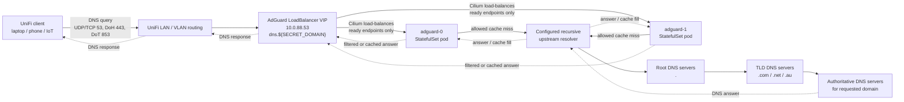

# AdGuard Home DNS

This directory contains the GitOps configuration for the internal AdGuard Home DNS service.

AdGuard is the filtering resolver for clients on the UniFi-managed internal network. Kubernetes pods continue to use CoreDNS for in-cluster service discovery; AdGuard is for LAN/VLAN clients and DNS-over-HTTPS / DNS-over-TLS clients using the internal DNS endpoint.

## DNS endpoint

| Purpose | Value |
| --- | --- |
| Hostname | `dns.${SECRET_DOMAIN}` |
| LoadBalancer VIP | `10.0.88.53` |
| Kubernetes Service | `network/adguard-dns` |
| Plain DNS | UDP/TCP `53` |
| DNS-over-HTTPS | TCP `443` |
| DNS-over-TLS | TCP `853` |

The `adguard-dns` Service is a Cilium LoadBalancer advertised from the routed `10.0.88.0/24` prefix. Clients keep a single resolver IP/hostname; Kubernetes and Cilium handle endpoint selection behind it.

## Cluster DNS dependency boundary

Talos nodes deliberately do **not** use AdGuard for node-level DNS. Their machine DNS is configured in `talos/patches/global/machine-network.yaml` to use only:

- `10.0.0.1` — UniFi gateway
- `1.1.1.1` — Cloudflare DNS fallback

This avoids a circular dependency where Kubernetes nodes would need the in-cluster AdGuard service to resolve names before the cluster, Cilium, storage, or AdGuard itself are healthy. AdGuard is the resolver for UniFi clients, not a bootstrap dependency for Talos nodes.

## Request path



Blocked queries and cache hits stop at AdGuard. Only allowed cache misses continue to the configured recursive upstream resolver and then through the root/TLD/authoritative DNS hierarchy.

## Runtime topology

- `adguard-0` and `adguard-1` run as a two-replica StatefulSet.
- Each pod has its own RWO Ceph PVC (`data-adguard-0`, `data-adguard-1`) so a stuck volume attachment on one node does not block the other pod.
- Topology spread keeps the two pods on separate Kubernetes nodes when possible.
- `network/adguard-dns` selects both ready pods for DNS/DoH/DoT traffic.
- `network/adguard-headless` gives stable pod DNS names for internal pod-to-pod operations.
- `adguardhome-sync` syncs AdGuard settings from `adguard-0` to `adguard-1` so both pods serve equivalent DNS/filtering configuration.

## Load balancing and failover

DNS traffic is active/active across both AdGuard pods:

```text
UniFi client → 10.0.88.53 → adguard-dns Service → adguard-0 or adguard-1
```

Cilium load-balances new DNS/DoH/DoT flows to the ready endpoints in the Service. This is L4 load balancing, not strict round-robin:

- UDP DNS distributes well because clients use varying source ports.
- TCP DNS and DoH may be stickier while a connection remains open.
- Query logs and statistics are per-replica, so totals are split across `adguard-0` and `adguard-1`.

When a pod becomes unhealthy, Kubernetes EndpointSlices remove it from `network/adguard-dns`. The surviving pod continues answering on the same VIP, so clients do not need to change resolver settings.

Observed pod-deletion failover test:

- Deleted `adguard-1` while continuously probing `10.0.88.53`.
- EndpointSlice marked the failed pod NotReady after about `0.31s`.
- EndpointSlice removed the failed endpoint after about `0.62s`.
- TCP DNS had no observed interruption.
- UDP DNS and DoH each saw one short transient miss before continuing through the surviving pod.

## Useful checks

```bash
# Check pods and placement
kubectl get pods -n network -l app.kubernetes.io/name=adguard -o wide

# Check the DNS Service and VIP
kubectl get svc -n network adguard-dns -o wide

# Check ready DNS endpoints
kubectl get endpointslice -n network \
  -l kubernetes.io/service-name=adguard-dns \
  -o jsonpath='{range .items[*].endpoints[*]}{.targetRef.name} {.addresses[*]} ready={.conditions.ready} node={.nodeName}{"\n"}{end}'

# Plain DNS smoke tests
dig @10.0.88.53 example.com
dig +tcp @10.0.88.53 example.com

# DoH / DoT smoke tests
doggo example.com A @https://dns.${SECRET_DOMAIN}/dns-query/adam-laptop --short
doggo example.com A @tls://10.0.88.53 --tls-hostname=dns.${SECRET_DOMAIN} --short
```

## Files

- `ks.yaml` — Flux Kustomization for AdGuard.
- `app/helmrelease.yaml` — StatefulSet, Services, sync controller, probes, and resource settings.
- `app/externalsecret.yaml` — native AdGuard credentials for `adguardhome-sync` from 1Password.
- `app/certificate.yaml` — TLS certificate used by DNS-over-HTTPS / DNS-over-TLS.
