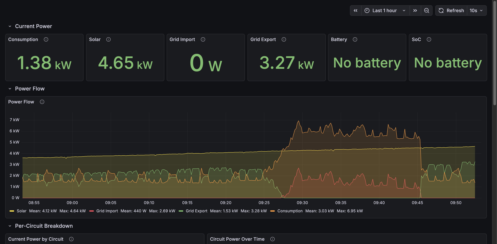
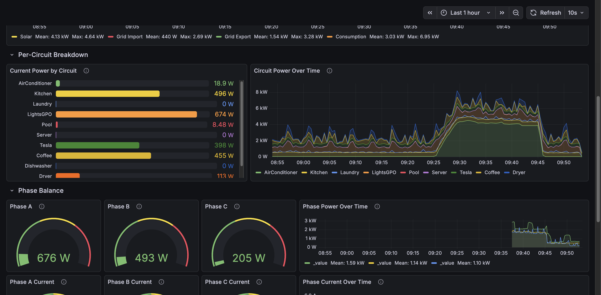
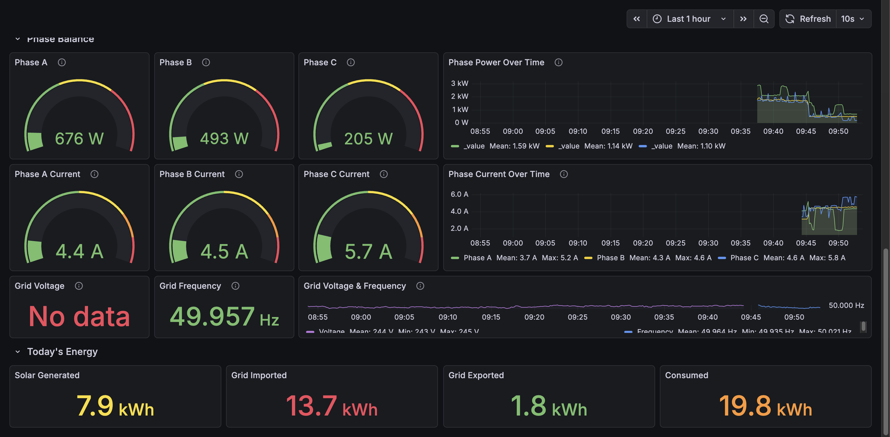
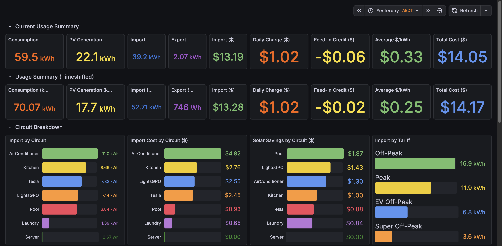
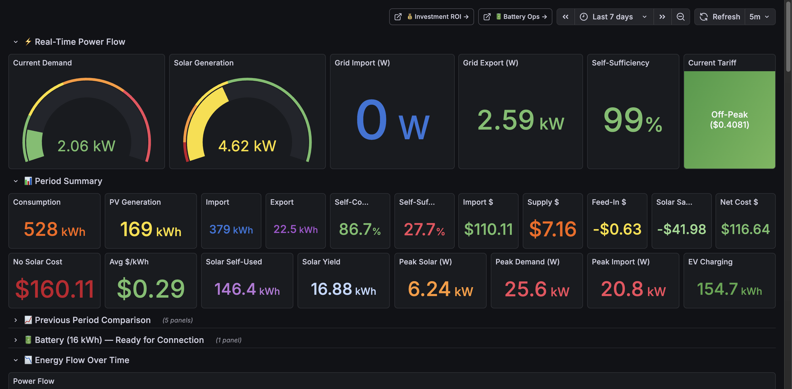
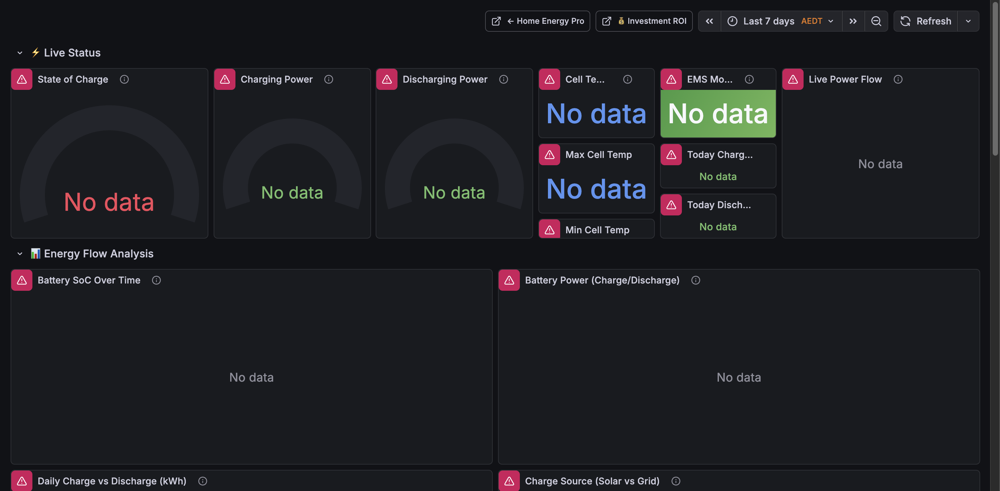
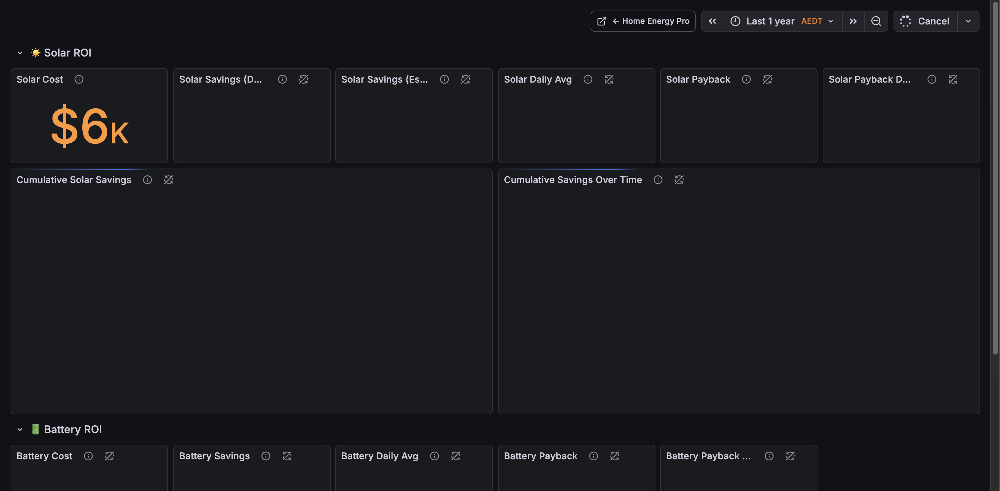

# Home Energy Grafana Dashboards

Custom Grafana dashboards for whole-house energy monitoring, powered by IoTaWatt CT clamps and (post-install) Sigenergy battery via sigenergy2mqtt.

**Grafana URL:** `https://grafana.petrovic.network`

## Dashboard Overview

| Dashboard | UID | Refresh | Default Range | Purpose |
|---|---|---|---|---|
| [Home Power — Live](#home-power--live) | `home-power-live` | 10s | Last 1h | Real-time power monitoring |
| [Home Energy](#home-energy) | `home-energy-tou` | Manual | Yesterday | Daily energy & cost summary |
| [Home Energy Pro](#home-energy-pro) | `home-energy-pro` | 5m | Last 7d | Detailed energy analysis |
| [Home Energy Battery](#home-energy-battery) | `home-energy-battery` | Manual | Last 7d | Battery performance & health |
| [Home Energy ROI](#home-energy-roi) | `home-energy-roi` | Manual | Last 1y | Solar & battery payback tracking |

## Data Sources

All dashboards query **InfluxDB** (Flux) with data from:

| Bucket | Source | Update Rate | Data |
|---|---|---|---|
| `iotawatt` | IoTaWatt energy monitor | 5s | Per-phase grid/solar CTs, circuit CTs, voltage, frequency |
| `homeassistant` | HA InfluxDB integration | On state change | Smart plug power sensors (Coffee, Dishwasher, Washing Machine, Dryer) |
| `sigenergy` | sigenergy2mqtt | 5s | Battery SoC, charge/discharge power, inverter per-phase output *(post-install)* |

### IoTaWatt Measurements

**Direct CTs (raw, always accurate):**
- `Grid_A`, `Grid_B`, `Grid_C` — per-phase grid power (Watts), current (Amps), frequency (Hz)
- `Solar_A`, `Solar_B`, `Solar_C` — per-phase solar generation (Watts)
- `GridA_V`, `GridB_V`, `GridC_V` — mains voltage (Volts, derived reference — same all phases)
- `Tesla` — EV charger (3-phase sum)
- `AirConditioner` — ducted AC (3-phase sum)
- `Pool` — pool pump
- `Server` — home server

**Calculated outputs (will be WRONG after battery install — do not use in new dashboards):**
- `Branch` — total consumption (Grid + Solar sum)
- `GridImport` — grid import only (positive values)
- `SolarExport` — grid export only (solar surplus)
- `SolarGeneration` — total solar (3-phase sum)
- `Kitchen`, `Laundry`, `LightsGPO` — remainder calculations per phase

---

## Home Power — Live

> **URL:** [/d/home-power-live/](https://grafana.petrovic.network/d/home-power-live/)
> **Purpose:** Real-time operational monitoring — the IoTaWatt web UI replacement.





### How to read it

#### Current Power (top row)
Six stat panels showing instantaneous power readings:
- **Consumption** — total house draw from `Branch` measurement. Green < 3kW, yellow 3–5kW, orange 5–8kW, red > 8kW.
- **Solar** — total PV generation. Colour ramps from blue (night/low) through yellow to green (> 4kW).
- **Grid Import** — power drawn from the grid. Green = minimal, red > 5kW. Ideally zero during solar hours.
- **Grid Export** — surplus solar being fed back. Green = exporting well.
- **Battery** / **SoC** — *Placeholder for Sigenergy install.* Shows "No battery" until connected.

#### Power Flow (time series)
Full-width chart showing the four key power flows over time:
- **Yellow** = Solar generation
- **Red** = Grid import (buying power)
- **Green** = Grid export (selling power)
- **Orange** = Total consumption

**What to look for:**
- Orange line should sit below yellow during sunny hours (self-consuming solar).
- Red spikes = appliance draws exceeding solar. Check which circuit in the breakdown below.
- Green area = surplus being exported — post-battery, this should shrink as surplus charges the battery.

#### Per-Circuit Breakdown
- **Bar gauge** (left) — snapshot of current power per circuit, sorted by draw. Includes both IoTaWatt CTs (Tesla, AirConditioner, Pool, Server, Kitchen, Laundry, LightsGPO) and HA smart plugs (Coffee, Dishwasher, Washing Machine, Dryer).
- **Stacked area** (right) — circuit power over time, stacked to show how total consumption is composed. Tall stacks = identify the culprit circuit.

#### Phase Balance
Two rows for monitoring 3-phase distribution:

**Power (Watts):**
- Three gauges showing per-phase consumption (Grid + Solar). Max 7.5kW per phase.
- Timeseries showing phase power over time. Lines should track roughly together — large divergence means unbalanced load.

**Current (Amps):**
- Three gauges showing grid current per phase. Thresholds: green < 20A, yellow 20–30A, orange 30–35A, red > 35A.
- Timeseries for current trending. Watch for sustained > 30A — indicates a phase is near capacity.

**What to look for:**
- Balanced phases = all three gauges roughly equal. This is the ideal state.
- One phase significantly higher = that phase carries a large single-phase load (e.g., AC compressor, EV charger, oven).
- Post-battery: Sigenergy inverter spreads charge/discharge across all three phases, which should help balance.

#### Grid Voltage & Frequency
- **Voltage** — Australian standard is 230V ±6% (216–254V normal range). Green = within spec. If consistently high (> 250V), contact your DNSP.
- **Frequency** — Nominal 50.000Hz. Green 49.95–50.05Hz. Below 49.85Hz = grid under stress (high demand). Below 49.75Hz = AEMO contingency event. This correlates with NEM wholesale price spikes.
- **Timeseries** — dual-axis chart. Voltage on the left (purple), frequency on the right (blue). Frequency dips are brief but visible — zoom in to correlate with high-demand periods.

*Note: Voltage and frequency are derived from the same reference transformer, so all three phases show identical values. True per-phase voltage requires individual VTs.*

#### Today's Energy (bottom row)
Running kWh totals since midnight (AEST):
- **Solar Generated** — total PV harvest today.
- **Grid Imported** — energy bought from grid today.
- **Grid Exported** — surplus solar sold today.
- **Consumed** — total house consumption today.

**Quick check:** Grid Imported should be low on sunny days. If Solar Generated > Consumed, you're net positive.

---

## Home Energy

> **URL:** [/d/home-energy-tou/](https://grafana.petrovic.network/d/home-energy-tou/)
> **Purpose:** Daily energy summary with TOU tariff cost breakdown. Default view is yesterday (completed day).



### How to read it

#### Current Usage Summary
Daily totals for the selected period: consumption, solar generation, grid import/export in kWh, plus cost breakdown (import cost, daily supply charge, feed-in credit, average $/kWh, total cost).

#### Circuit Breakdown
- **Import by Circuit** — which circuits drew the most grid power (kWh).
- **Import Cost by Circuit** — same data but in dollars — shows which circuits cost the most.
- **Solar Savings by Circuit** — how much each circuit saved by using solar instead of grid.

#### Detailed Summary
- **Import by Tariff** — grid import split by EV ($0.08), off-peak ($0.41), super off-peak ($0.00), and peak ($0.61). Aim to shift load into cheaper windows.
- **Daily Import Cost** — bar chart of daily costs over time.
- **Daily Average $/kWh** — effective blended rate. Lower = better tariff arbitrage.

---

## Home Energy Pro

> **URL:** [/d/home-energy-pro/](https://grafana.petrovic.network/d/home-energy-pro/)
> **Purpose:** Comprehensive energy analysis — power flow, cost analysis, solar performance, circuit breakdown, and trend projections over 7 days.



### Key sections

- **Real-Time Power Flow** — current demand, solar, grid import/export, self-sufficiency percentage, current tariff rate.
- **Period Summary** — kWh totals and cost for the selected period.
- **Energy Flow Over Time** — stacked area chart showing power sources and consumption.
- **Cost Analysis** — import cost by tariff, heatmap of import by hour × day (spot patterns), daily cost trend.
- **Solar Performance** — generation over time, daily generation bars, solar utilization (self-consumed vs exported).
- **Circuit Breakdown** — per-circuit import, cost, and solar savings.
- **Trends & Projections** — projected monthly bill, projected annual solar savings, average daily usage patterns.
- **Battery** — live battery status panels *(populated after Sigenergy install)*.

---

## Home Energy Battery

> **URL:** [/d/home-energy-battery/](https://grafana.petrovic.network/d/home-energy-battery/)
> **Purpose:** Battery-specific performance monitoring and financial impact analysis.



*All panels require sigenergy2mqtt data — will show "No data" until battery is installed.*

### Key sections

- **Live Status** — SoC gauge, charge/discharge power, cell temperature, EMS mode.
- **Energy Flow Analysis** — SoC over time, charge/discharge power chart, daily charge vs discharge bars, charge source breakdown (solar vs grid), discharge offset by tariff period.
- **Financial Impact** — daily and monthly battery savings, savings broken down by tariff period offset.
- **Health & Efficiency** — round-trip efficiency, daily cycle count, temperature history, cumulative cycles, cost per kWh cycled, lifetime totals.

---

## Home Energy ROI

> **URL:** [/d/home-energy-roi/](https://grafana.petrovic.network/d/home-energy-roi/)
> **Purpose:** Long-term return on investment tracking for solar and battery systems.



*Battery ROI panels require sigenergy2mqtt data — will populate after install.*

### Key sections

- **Solar ROI** — total solar system cost, cumulative savings from data, estimated total savings (including pre-monitoring period), daily average savings, payback progress and estimated payback date.
- **Battery ROI** — same structure for the battery investment.
- **Combined Investment** — total investment across both systems, combined payback timeline, annual savings rate.

---

## Deployment

Dashboards are deployed via Flux GitOps:

1. Dashboard JSON files live in `dashboards/`
2. `kustomization.yaml` generates ConfigMaps from each JSON file
3. `grafanadashboard.yaml` defines GrafanaDashboard CRs that reference the ConfigMaps
4. The Grafana Operator watches for GrafanaDashboard CRs and provisions them

To add or update a dashboard:
```bash
# Edit the JSON file
vim dashboards/home-power-live.json

# Commit and push (Flux reconciles automatically)
cd ~/code/home-ops
jj describe -m "feat(grafana): update dashboard description"
jj bookmark set main -r @
jj git push -b main
```

## OVO EV Tariff Reference

Used in cost calculations across the energy dashboards:

| Window | Rate | Condition |
|---|---|---|
| 12am–6am | $0.08/kWh | EV Off-peak (all year) |
| 6am–11am | $0.4081/kWh | Off-peak (all year) |
| 11am–2pm | $0.00/kWh | Super Off-peak (all year) |
| 2pm–3pm | $0.4081/kWh | Off-peak (all year) |
| 3pm–9pm | $0.6127/kWh | Peak (Jan–Mar, Jun–Aug, Nov–Dec) |
| 3pm–9pm | $0.4081/kWh | Off-peak (Apr–May, Sep–Oct) |
| 9pm–12am | $0.4081/kWh | Off-peak (all year) |

Daily supply charge: $1.023/day

## Screenshots

Screenshots are stored in `dashboards/screenshots/`. To update, replace the PNGs and commit.
